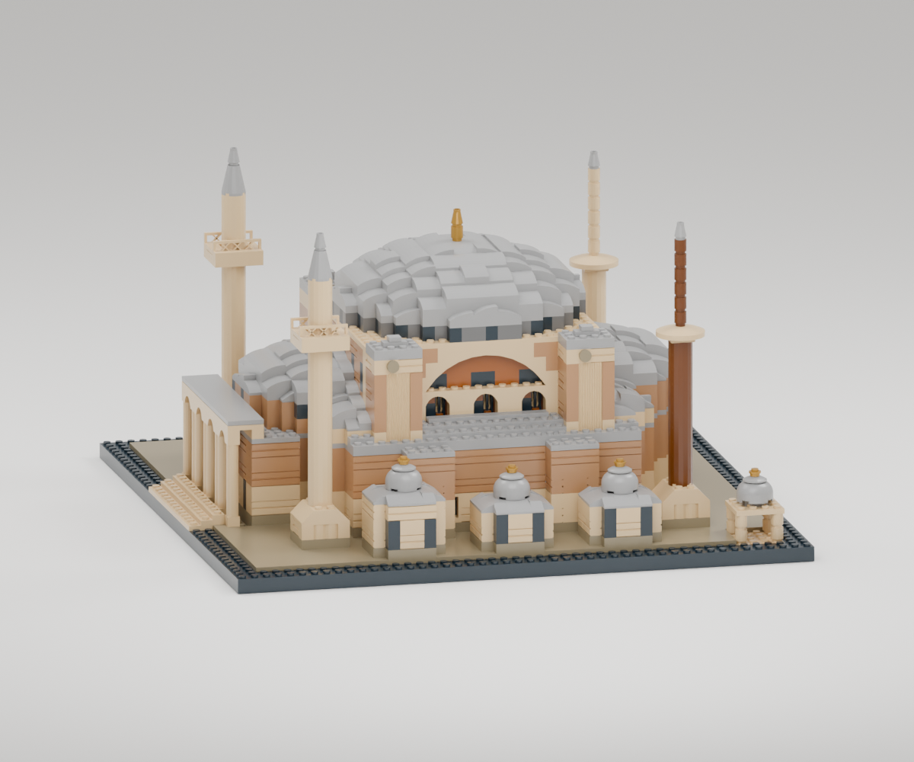
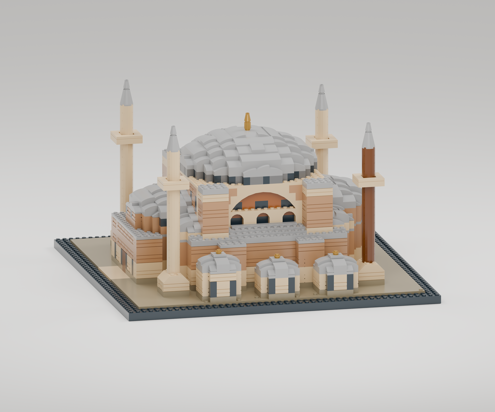

# Revizyon 05 — LEGO Architecture teknikleri

Kullanıcının Ayasofya fotoğrafı ve önceki çok açılı mimari inceleme korunarak,
gerçek LEGO Architecture yapım kılavuzları parça ve bağlantı tekniği açısından
incelendi. Kılavuz sayfaları pakete kopyalanmadı; aşağıdaki kaynaklar LEGO'nundur.

| İncelenen kaynak | Gözlenen teknik | Ayasofya uygulaması |
|---|---|---|
| [Taj Mahal 21056, resmî PDF](https://www.lego.com/cdn/product-assets/product.bi.core.pdf/6398433.pdf), PDF sayfa 116, 121–126 | Küçük düzgün kubbe, çanak ve merkezli tepe süsü; dairesel minare bileşenleri | Şadırvanda 49308 kubbe, 4032 kasnak, 4740 çanak ve 4073 alem; doğu minarelerinde 3960 dairesel şerefe |
| [Notre-Dame 21061, resmî PDF](https://www.lego.com/cdn/product-assets/product.bi.core.pdf/6634577.pdf), PDF sayfa 40, 130, 160, 270 | Tekrarlanan sütun/pencere modülleri, geriye çekilmiş koyu açıklıklar ve yana bakan pimlerle cephe ayrıntıları | 43888 ince sütunlar, 60592 gerçek pencere çerçeveleri, 32952 üzerinde düşey 2412b ızgaralar, 87087 üzerinde 98138 taş madalyonlar |

Gotik pencere biçimleri veya Tac Mahal'in soğan kubbesi Ayasofya'ya
aktarılmadı. Burada alınan şey parça kullanma ve birleştirme tekniğidir.
Ana kubbe geniş ve basık, cephe kemerleri yuvarlak, güney ekleri üç ayrı
kubbeli hacim olarak tutuldu. Batı revağı ve şadırvan ölçekli mimari yorumdur;
birebir rölöve iddiası taşımaz.

## Görüntüyle yapılan ikinci tur

İlk yeni denemede güneydeki üç çatıda kullanılan 3×3 düzgün kubbeler,
6 stud genişliğindeki yapıların üzerinde fazla küçük ve dik göründü. Bu üç
çatı tekrar geniş, kavisli parçalardan oluşan basık kubbelere dönüştürüldü;
49308 parçası küçük şadırvanda kaldı. Doğu minarelerinin ince üst gövdeleri
altı yuvarlak tuğladan üçe indirildi. Böylece daha fazla parça kullanma amacı,
Ayasofya'nın oranlarının önüne geçmedi.

Ek ayrıntılar: 2877 oluklu payanda şeritleri, 30136 yuvarlatılmış kaide
profilleri, 3633 kafes şerefe korkulukları, 30055 avlu korkulukları ve
3794b merkezli küçük kapak taşları. Parçalar gerçek LDraw geometrileriyle
çizilir; eklenmiş dekoratif sahte geometri bulunmaz.

Yan cephe parçaları özel olarak modellenen iki taşıyıcıya bağlanır:
87087'nin tek, 32952'nin iki dışa bakan pimi. Rehber bunları taşıyıcı
koordinatı ve baktığı yönle ayrı montaj tablosunda gösterir. Alışveriş
listesinde LDraw 3070b karosu BrickLink 3070 olarak eşleştirilir.

## Bu turda eklenen 15 parça türü

| LDraw kodu | Adet | Modeldeki işlevi |
|---|---:|---|
| 49308 | 1 | Şadırvanın düzgün kubbesi |
| 3960 | 2 | Dairesel minare şerefesi |
| 4740 | 4 | Küçük kubbelerin alem kaidesi |
| 4032 | 1 | Şadırvan kubbesinin yuvarlak bağlantı plakası |
| 30055 | 4 | Avlunun açık korkuluğu |
| 60592 | 8 | Gerçek pencere çerçevesi |
| 2877 | 20 | Oluklu düşey payanda yüzeyi |
| 43888 | 8 | Batı revağının ince yuvarlak sütunları |
| 3633 | 4 | Batı minarelerinin kafes korkulukları |
| 30136 | 4 | Minare kaidesinin yuvarlatılmış yüzeyi |
| 3070b | 32 | Küçük düz kaplama taşları |
| 3794b | 4 | Yarım stud kaydırılmış başlık taşı bağlantısı |
| 87087 | 4 | Tek yan pimli madalyon taşıyıcısı |
| 32952 | 6 | Çift yan pimli pencere ızgarası taşıyıcısı |
| 98138 | 4 | Yuvarlak cephe madalyonu |
