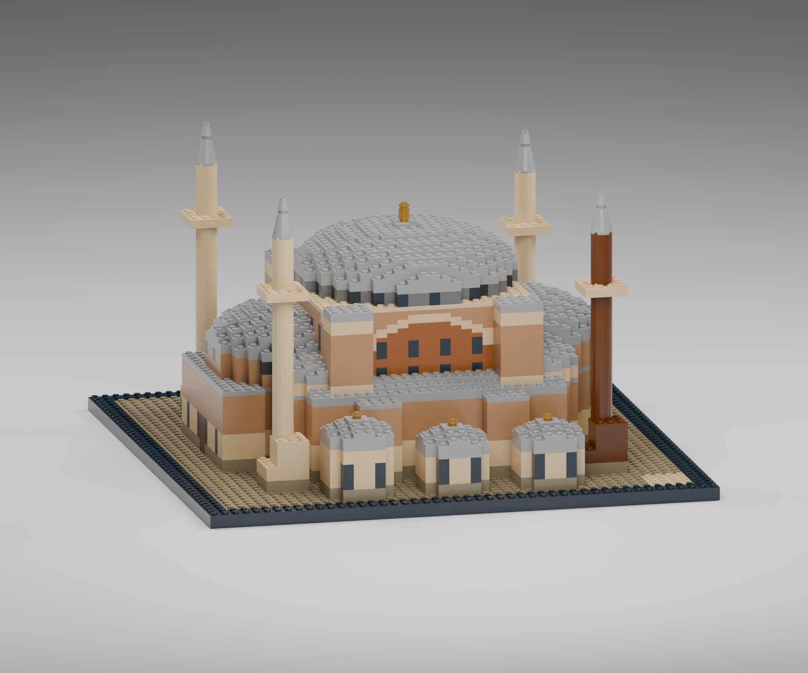
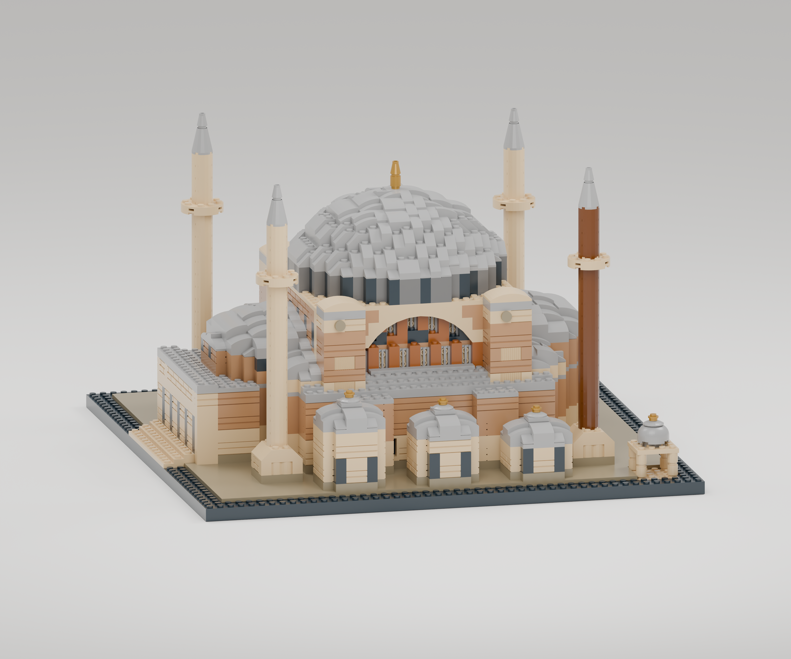
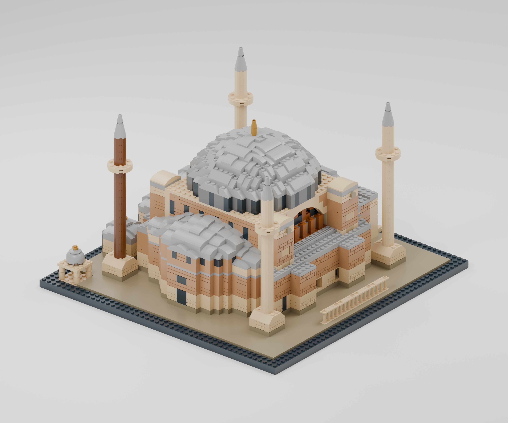

# Revizyon04 — biçimli parçalarla ayrıntı

Kullanıcının düz blok ağırlıklı siluet eleştirisi üzerine, önceki fotoğraf
referansları korunarak parçaların biçimleri değiştirildi. Model yalnızca
daha yüksek piksel sayısıyla yeniden görüntülenmedi; yüzey geometrisi ve
bağlantıları yeniden kuruldu.

## Önce

## Yeni parça çözümleri

| Bölge | Önce | Revizyon04 |
| --- | --- | --- |
| Kubbe | Üstü studlu plaka katları | 122 adet15068, 74 adet11477 kavisli kaplama ve24 adet54200 küçük eğim |
| Ana cephe | Dolu duvarda renkli kemer deseni | İki6108 geniş kemer vealtı3659 pencere kemeri; geride koyu açıklıklı duvar |
| Taş yüzey | Düz tuğla yüzü | Bazı dış yüzlerde98283 kabartmalı taş örgüsü |
| Minare kaidesi | Dik basamak | 3039 eğimli geçiş veüstte yuvarlak gövde |
| Şerefe/avlu | Açık studlu yüzey | Düz karolarla kaplama |
| Yan nef | Plaka sırtı | 2412b çizgisel çatı ayrıntısı |
| Görüntü | 1800×1500 | Ön ve kuzeydoğu3840×3200; doğu/batı1800×1500 |

## Son model

Model 3.482 parça, 31 parça türü, 9 renk, 75 parça-renk kalemi ve53 yapım adımıdır.
Kavisli kaplamalar standart LEGO parçalarıdır; özel geometri veya esnetilmiş
parça kullanılmaz. İlk taslakta kavislerin yükseltilmiş alt sıraları boş bırakıldığı için
kubbe üzerinde küçük koyu yarıklar görülüyordu. Resmî geometrideki bir plaka
boşluğu196 destek plakasıyla dolduruldu. Bu düzeltme yüzeyi kapatır ve
1×2 kavislerde iki, 2×2 kavislerde dört gerçek bağlantı sağlar. Rehberde önce
desteklerin, sonra kavislerin takılacağı ayrı planlarla gösterilir. Büyük
kemerin basamaklarında farklı yükseklikteki bağlantılar ayrıca hesaplanır.

Kubbeler bu ölçekte hâlâ parçalı bir yüzeydir; mimari eğrinin sürekli bir
kopyası değildir. Kemerlerin iç boşluğu vardır fakat bütün bina iç mekânı
modellenmemiştir. Fiziksel montaj yapılmadı.

[Çok açılı fotoğraf kaynakları ve önceki turlar](photo-comparison.md).
[Resmî geometri ve katalog kanıtları](catalog-sources.md).
