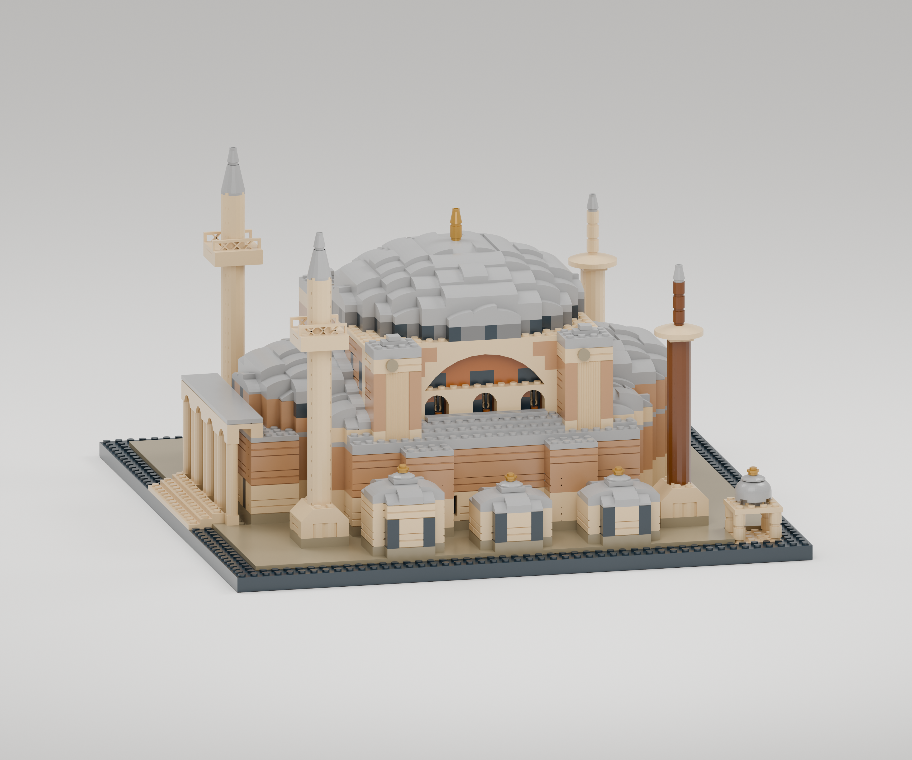
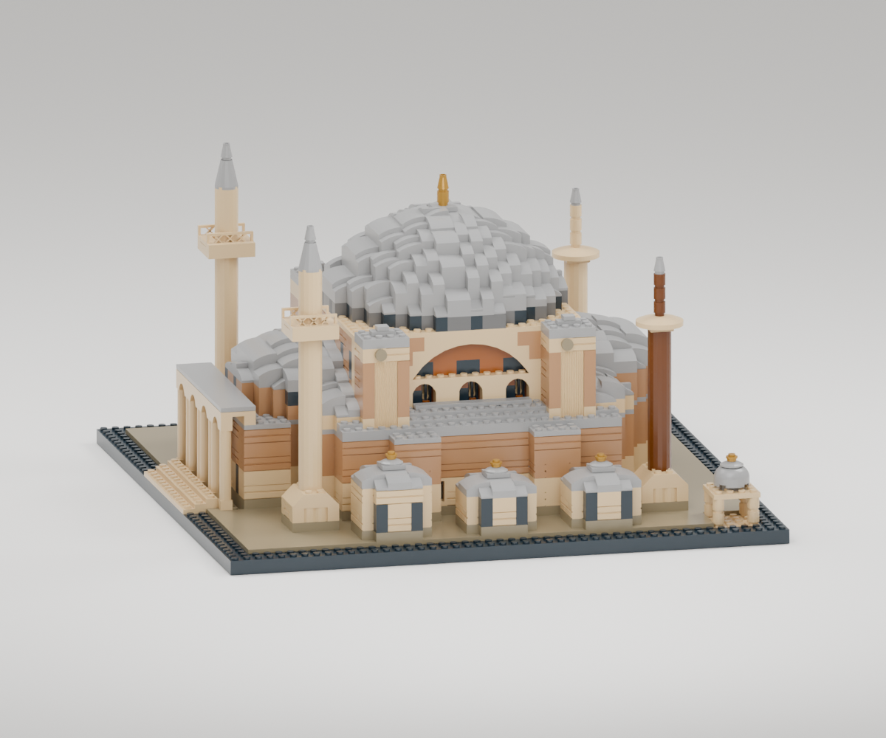

# Revizyon 06 — daha kavisli ana kubbe

Kullanıcı önceki kubbeyi fazla basık buldu ve başka kubbeli LEGO yapılardan
ilham alınmasını, ayrıca agy ile görsel görüş alınmasını istedi.

## İncelenen gerçek LEGO kubbeleri

- [LEGO Architecture Capitol 21030, resmî kılavuz](https://www.lego.com/cdn/product-assets/product.bi.core.pdf/6163626.pdf), PDF sayfa 160–167: dairesel destek katları, dört çeyrek kabukla kubbe ve merkezî tepe bileşeni. Ayasofya'da alınan ilke, kubbe ile kasnağın ayrılması ve tepeye doğru yumuşayan sürekli bir dış profildir. Capitol'ün yüksek sütunlu kasnağı aktarılmadı.
- [LEGO Architecture Taj Mahal 21056, resmî kılavuz](https://www.lego.com/cdn/product-assets/product.bi.core.pdf/6398433.pdf), sayfa 116: yan pimlere bağlanan kavisli paneller ve üstte çeyrek kabuklar. Farklı eğim bölgelerinde farklı geometriler kullanma fikri incelendi. Ayasofya'ya soğan kubbe biçimi veya bu setin küçük kabuğunun aynısı aktarılmadı.

Kılavuz sayfaları görsel olarak incelendi; PDF dosyaları ve LEGO'ya ait
sayfa görselleri teslim paketine kopyalanmadı.

## Gemini ile üç tur

Kullanıcının belirttiği `agy` komutu Antigravity CLI'yi açtı. Gemini 3.1 Pro,
ön ve arka model görüntülerini ve kullanıcının Ayasofya fotoğrafını görüntüledi.
Ona yalnızca görsel eleştiri görevi verildi; model kaynaklarını değiştirmedi.

1. [İlk görüş](agy-dome-review.md): 12 plaka yükselişin 18–20'ye çıkarılması,
   küresel başlık profili, dar parçalar ve eğime göre parça seçimi önerildi.
2. [İkinci görüş](agy-dome-round2.md): 18 plakalı ilk taslağın silueti daha
   yuvarlak, fakat kısa kavisli parçalarla kaplanan alt kuşağı fazla basamaklı
   bulundu. Daha dik 3040 eğimleri önerildi.
3. [Üçüncü görüş](agy-dome-round3.md): 3040b alt kuşağı ile dar kavisli üst
   kuşağın birlikte kullanıldığı ikinci taslak görsel açıdan tercih edildi.

Bunlar başka bir modelin estetik değerlendirmeleridir. Raporlardaki güçlü
benzerlik veya yapı ifadeleri, mimari ölçüm ya da fiziksel montaj kanıtı
sayılmaz. Bağlantılar ayrıca kendi sayısal denetimimizle kontrol edildi.

## Uygulanan geometri

- Çap: 20 stud, değişmedi.
- Kubbe yükselişi: 12 → 18 plaka, yani 38,4 → 57,6 mm; %50 artış.
- Kasnak tabanı ve bina gövdesi korunur; alem kubbeyle birlikte yükselir.
- Önceki elipsoit profili yerine küresel başlık kullanılır. Yatay ölçüler
  stud, düşey ölçüler önce stud birimine çevrilir: `h = rise × 0.4`,
  `R = (a² + h²)/(2h)`, `z(r) = sqrt(R² − r²) − (R − h)`.
- Ana kubbenin alt bandında 88 adet 3040b (BrickLink 3040) dik 1×2 eğim,
  üst bandında 64 adet 11477 dar kavisli parça bulunur. Sekiz küçük 54200 eğim
  dairesel sınırın kalan hücrelerini kapatır. Merkezde 87580 alem taşıyıcısı vardır.
- Diğer kubbelerin önceki biçimleri korunur. Kubbeyi sayısal olarak ölçekleyen
  sahte geometri veya eğilmiş LEGO parçası kullanılmaz.

## Teslim kontrolü

3.849 parça, 47 tür, 9 renk, 101 parça-renk kalemi ve 61 katman adımı.
45 test geçti; 3.849 gerçek LDraw yerleşiminde sıfır sınır/dönüş uyuşmazlığı.
Sıfır muhafazakâr gövde çakışması veya desteksiz parça, 5.856 bağlantıyla tek ağ.
Yeni 3040b parçalarının ikişer alt pimi desteklenir. 101/101 katalog renk
kaydı doğrulandı. Fiziksel montaj ve dayanım testi yapılmadı.
