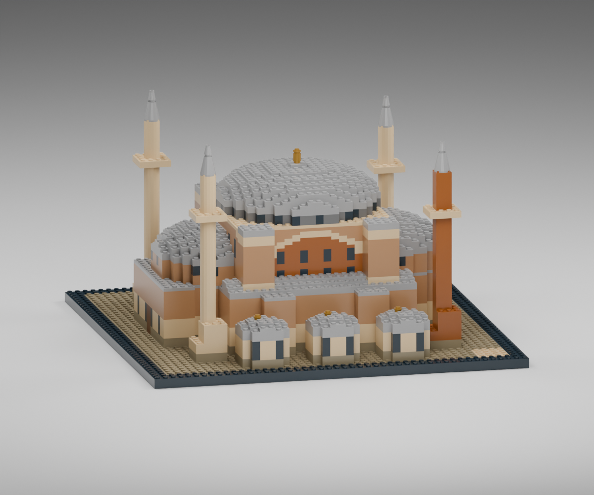
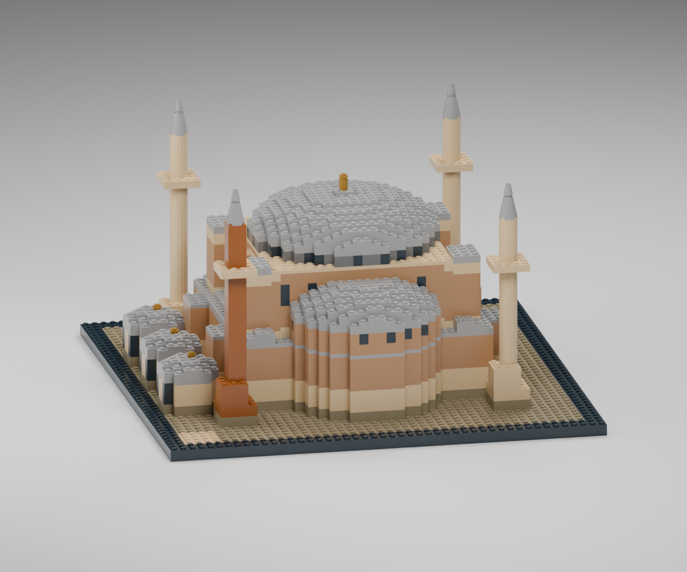
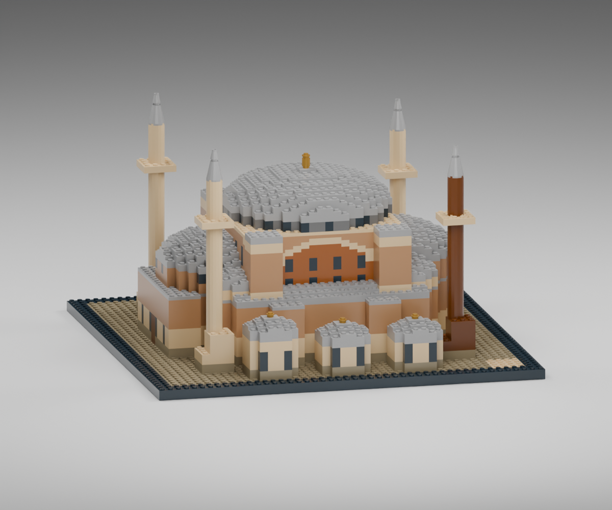
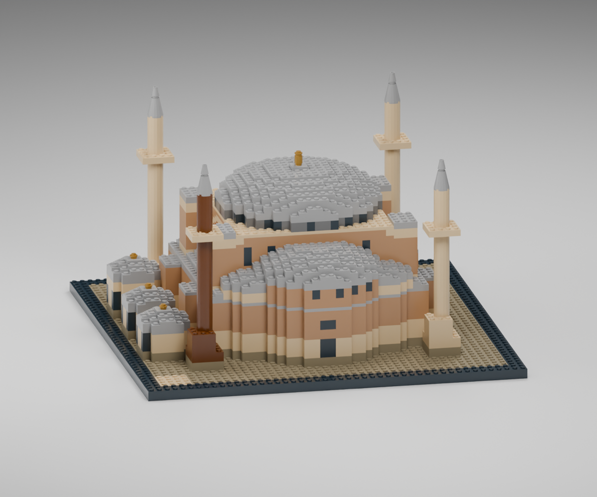

# Ayasofya: farklı açılardan fotoğraf karşılaştırması

Bu çalışma, fotoğraflarda görülen kütle ilişkilerini 48 × 48 stud tabana uyarlayan bir LEGO yorumudur. Aşağıdaki stud ve plaka ölçüleri fotoğraftan alınmış mimari ölçüler değil, model ölçeğine yönelik tasarım önerileridir. Renderlar `.ldr` içindeki gerçek parça yerleşimlerinden, resmi LDraw üçgen/dörtgen geometrisiyle üretilir.

## Fotoğraf kaynakları

Fotoğraflar 6 Eylül 2026 tarihindeki araştırmada, farklı yönlerin birbirini tamamlaması için seçildi. Kaynak fotoğraflar dağıtım paketine eklenmez; aşağıdaki bağlantılar görsel dayanakları gösterir.

| Kaynak | Karşılaştırmada kullanımı |
| --- | --- |
| [Oberlin College — Art 310, hava görünümü](https://www2.oberlin.edu/images/Art310/Art310d.html) | Ana kubbe ile yarım kubbelerin ilişkisi, küçük yan kubbeler, payandaların plan içindeki çıkıntısı |
| [Wikimedia Commons — Rear view of Hagia Sophia (3)](https://commons.wikimedia.org/wiki/File:Rear_view_of_Hagia_Sophia_(3).JPG) | Doğu cephesinde apsisin düşeyliği, pencereli kasnaklar ve kademeli çatı kütleleri |
| [Smarthistory — Architecture and the Fourth Crusade](https://smarthistory.org/architecture-and-the-fourth-crusade/) | Batı yönündeki kütle düzeni ve giriş tarafının ana gövdeye oranı |
| [Rudyfoto — Turkey](https://www.rudyfoto.com/turkey/) | Payandaların yakından görünümü ve düşey kütlelerinin cepheden çıkıntısı |

Tablodaki mimari değerlendirmeler, bu görsellerin incelenmesinden çıkarılan tasarım yorumlarıdır; kaynakların yazılı olarak bildirdiği ölçüler gibi sunulmaz.

## İlk karşılaştırmanın bulguları

2.702 parçalık önceki sürümün güney görünümü, hava fotoğrafı ve doğu cephesi fotoğrafıyla karşılaştırıldı.

| Öncelik | Fotoğrafta görülen özellik | Önceki modeldeki fark | Stud ölçeğinde düzeltme önerisi |
| --- | --- | --- | --- |
| 1 | Yüksek ana gövdenin çevresinde çıkıntılı, düşey payanda kütleleri | Kemerin bulunduğu gövde tek ve düz bir kutu gibi görünüyordu | Kemerin iki yanında ve karşı cephede yaklaşık 3 stud genişlik × 2 stud çıkıntılı dört yüksek payanda; yan nef çatısından ana saçak seviyesine kadar yükselme |
| 2 | Büyük kubbe, yüksek yarım kubbeler ve daha küçük yan kubbelerden oluşan kademeli çatı | Ana kubbe kapağı fazla yassı; yarım kubbeler alçak çatıya doğrudan oturuyor; ikincil kubbe kütleleri eksik | 20 stud çaplı ana kubbede 8 yerine yaklaşık 10–12 plaka yükselme; yarım kubbelerin başlangıcını yükseltme, altında pencereli kasnak, yanlarda 4–6 stud çaplı ikincil kubbeler |
| 3 | Minarelerde geniş, giderek daralan kaide ve ince, uzun külah | Düz kare kaideden aniden ince gövdeye geçiş; kısa ve kalın uç | Yaklaşık 12–15 plaka boyunca 4 → 3 → 2 stud kademelenen kaide; yaklaşık 10–12 plaka yüksekliğinde, 1 stud uca incelen külah |

Renk bakımından fotoğraflar farklı ışık, tarih ve yüzey durumları içerir. Güncel modelin açık gri çatıları, sıcak duvarları, koyu pencere kasnağı ve altın alem ayrımı korunur; amaç tek fotoğrafın piksel rengini kopyalamak değildir.

## İterasyon 1 — 2.869 parça

Ana kubbe kapağı 10 plaka yüksekliğine çıkarıldı. Yarım kubbelerin başlangıcı yükseltildi ve altlarına pencereli kasnak eklendi. Kemerin yanına çıkıntılı yüksek payandalar, minarelere kademeli kaideler ve `4589` parçalı daha ince uçlar eklendi. `87580` parçası, alem bağlantısını ortalamak için kullanıldı.

Güney görünümünde düz kutu etkisi azaldı; payandalar cepheye derinlik kattı. Doğu görünümünde yükseltilmiş yarım kubbe ve kasnak okunur hale geldi. Ancak yarım kubbenin iki yanındaki küçük kubbe kütleleri hâlâ eksikti; alt apsis yüzeyi fotoğrafa göre boş, kırmızı minare gövdesi ise köşeliydi. Bu gözlemler ikinci düzeltme turuna aktarıldı.





## İterasyon 2 — 3.016 parça

Yarım kubbelerin iki yanına dört küçük yarım kubbe eklendi; bunların taşıyıcı alt kütleleri ve yan nef çatıları birlikte düzenlendi. Doğu apsisine ek pencere rengi işlendi. Tuğla minarenin gövdesi yuvarlak, kızıl kahverengi `3941` parçalarına dönüştürüldü. Ön taraftaki üç küçük yapının yükseklikleri farklılaştırıldı ve alemleri ortalandı.

İkinci turun güney ve doğu renderları incelendi. Doğuda büyük yarım kubbenin iki yanındaki küçük çatıların oluşturduğu basamaklar, hava fotoğrafındaki kütle ilişkisine daha yakın görünüyor. Yuvarlak minare gövdesi ve ön eklerin farklı yükseklikleri, önceki tekdüze görünümü azalttı. Görsel incelemede havada kalan parça veya bariz çakışma görülmedi; bu gözlem bağımsız geometri denetiminin yerine geçmez.





Fotoğraftaki uzun kemerli pencereler bu ölçekte dikdörtgen renk alanlarıyla, sürekli kavisli çatılar ise kademeli plakalarla temsil edilir. Minare külahları gerçek konik parçaların birleşimidir; kesintisiz bir mimari koni değildir. Bunlar görsellerde saklanmayan model sadeleştirmeleridir.

## Son model görünümleri

Aynı son `.ldr` dosyasından üretilen yüksek çözünürlüklü görünümler: [güney](../dist/ayasofya.png), [kuzeydoğu üç çeyrek](../dist/ayasofya-arka.png), [doğu](../dist/ayasofya-dogu.png), [batı](../dist/ayasofya-bati.png).

## Tekrarlanabilir karşılaştırma kameraları

Model koordinatlarında +X güney, +Z doğudur. Blender dönüşümünde LDraw +Z, Blender +Y olur. Tüm görünümler ortografiktir; böylece perspektif değişiminin neden olduğu oran farkları sınırlandırılır.

| Görünüm | Yön ve amaç |
| --- | --- |
| `hero` | Güney cephesine yakın, biraz batıdan, alçak açı: anıtsal kemer ve ön ekler |
| `east` | Doğudan, hafif güneyden: doğu yarım kubbesi, apsis ve çatı basamakları |
| `west` | Batıdan, hafif güneyden: batı yarım kubbesi ve giriş kütlesi |
| `rear` | Kuzeydoğudan yüksek üç çeyrek: kubbelerin ve payandaların derinliği |
| `top` | Yukarıdan: kubbe planları ve parça kütlelerinin yerleşimi |

Hızlı karşılaştırma örneği:

```sh
blender --background --factory-startup --python scripts/render_model.py -- dist/ayasofya.ldr /tmp/ayasofya-east-draft.png east draft
```

`draft`, 1200 × 1000 piksel ve 24 örnek kullanır. Son argüman kaldırıldığında 1800 × 1500 piksel, 48 örnek kullanılır. Aynı modelin farklı görünümlerinde model geometrisi, renkler ve ışık düzeni aynıdır; yalnızca kamera değişir.

Geometrik sınır denetimi, parça bağlantılarının mekanik dayanıklılığını veya fiziksel kurulum sonucunu doğrulamaz. Fotoğraf benzerliği de ölçekli bir mimari rölöveye uygunluk anlamına gelmez.
